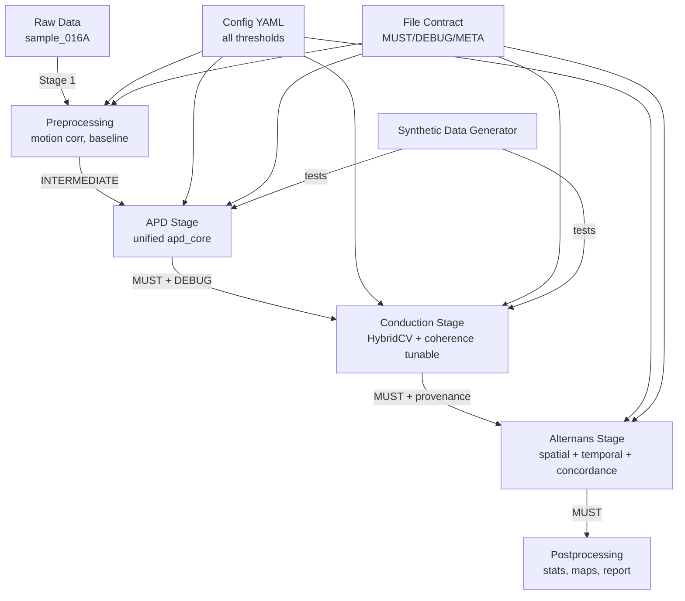

# Предложение по организации пайплайна обработки оптических данных сердца

**Дата:** 2026-06-29  
**Автор:** Grok (на основе ревью гайда)  
**Контекст:** Ревью предоставленного гайда `Pasted Text-....txt` (мета-описание текущего состояния пайплайна Stages 1–6)

## 1. Краткий анализ текущего состояния (из гайда)

### Сильные стороны
- Отличная **файловая дисциплина** (5-классная система: MUST / DEBUG / INTERMEDIATE / META / EXTERNAL) — одна из лучших практик.
- Хорошая поддержка двух красителей (A = VSD/data_inv, B = Ca²⁺/loaded_video).
- Зрелая реализация `source_cv_agent.py` (радиальный профиль + Structure Tensor + local_fit + filled_hybrid с provenance).
- Экспериментальные скрипты (`_exp_st_no_coh.py`, `_viz_016A_post_patch.py`) хорошо документируют историю багов.

### Критические проблемы (приоритет по важности)
1. **Structure Tensor coherence filter** — самая большая боль: оригинальный `coh > 0.1` отбрасывает **88–94%** валидных пикселей. Патч (`integration_sigma=4.0`, `cap=5.0`) помогает, но фундаментально не решён. `filled_hybrid` — хорошее pragmatic-решение.
2. **Дублирование логики APD**: `apd_agent.py` (Stage 2) и `apd_worker.py` (Stage 3) частично дублируют код.
3. **Inconsistencies**:
   - Терминология dye=B ("upstroke"/"rise time", "repol"/"decay").
   - `PIXEL_SIZE_MM = 0.85` централизован не везде (риск старых hardcoded `1.0`).
   - ASLS baseline считается дважды в `apd_worker.py`.
4. **Отсутствует критически**:
   - Центральный runner / DAG всех стадий.
   - Автоматические тесты (pytest) + synthetic data generator.
   - Полная параметризация всех порогов (coherence, poly_order local_fit, search windows и т.д.).

Гайд правильно рекомендует **Вариант A** как приоритет №1 (coherence + conduction_analysis).

## 2. Цели новой организации
- **Воспроизводимость** и provenance на каждом этапе.
- **Модульность** + лёгкость рефакторинга и тестирования.
- **Централизованная конфигурация** всех параметров.
- **Единый orchestrator** стадий (DAG-like).
- **Тесты** на синтетических данных (чтобы ловить регрессии coherence, APD и т.д.).
- **Единообразие** терминологии, контрактов ввода/вывода и стиля кода.
- Сохранение сильных сторон (file contract, filled_hybrid, поддержка двух dyes).

## 3. Рекомендуемая структура проекта

```
cardiac_optical_pipeline/          # корень проекта (можно положить в /home/workdir/artifacts/ или отдельный repo)
├── README.md
├── requirements.txt               # numpy, scipy, scikit-image, pandas, pyyaml, pydantic, matplotlib, imageio, tqdm...
├── pyproject.toml                 # (опционально) для установки как пакета
├── config/
│   └── default.yaml               # ВСЕ параметры + пути + thresholds
├── src/
│   └── cardiac_pipeline/
│       ├── __init__.py
│       ├── config.py              # Pydantic модель + загрузка YAML + валидация
│       ├── runner.py              # ГЛАВНЫЙ оркестратор (Pipeline class)
│       ├── stages/
│       │   ├── base.py            # BaseStage с enforce_file_contract, provenance, logging
│       │   ├── stage1_preprocessing.py
│       │   ├── stage2_apd.py      # unified (вместо apd_agent + apd_worker)
│       │   ├── stage3_conduction.py
│       │   ├── source_cv_agent.py # рефакторнутый (или переименовать в cv_estimators.py)
│       │   ├── stage4_alternans.py
│       │   └── stage5_postprocessing.py  # статистика, экспорт, отчёты
│       ├── utils/
│       │   ├── file_contract.py   # MUST, DEBUG, INTERMEDIATE, META, EXTERNAL + enforce()
│       │   ├── signal.py          # ASLS, baseline, landmarks, APD core functions
│       │   ├── cv_estimators.py   # StructureTensor, Gradient, HybridCV, coherence utils
│       │   ├── synthetic.py       # Генератор синтетических данных
│       │   └── provenance.py      # хэши, git sha, params dump
│       └── visualization.py
├── tests/
│   ├── conftest.py
│   ├── test_synthetic.py
│   ├── test_apd.py
│   ├── test_conduction.py         # особенно coherence edge cases
│   └── test_runner.py
├── experiments/                   # архив старых _exp_*.py + README с историей багов
│   └── archive_2025/
├── docs/
│   ├── ARCHITECTURE.md            # эта схема + mermaid диаграммы
│   ├── REVIEW_GUIDE.md            # расширенная версия текущего гайда + чек-листы
│   └── REVIEW_LOG.md              # append-only лог сессий ревью
├── data/
│   ├── raw/                       # 016A/, другие сэмплы (или symlink)
│   └── processed/
├── results/
│   └── {sample_id}/
│       ├── MUST/
│       ├── DEBUG/
│       └── META/
└── scripts/
    └── run_sample.py              # CLI entrypoint: python -m scripts.run_sample --sample 016A --config ...
```

**Почему именно так?**
- `src/cardiac_pipeline/` — стандартный layout (удобно для `pip install -e .`).
- `stages/` — явные, нумерованные, наследуют BaseStage.
- `utils/` — переиспользуемый код (убирает дублирование APD).
- `config/` + `config.py` — решает проблему "не везде PIXEL_SIZE_MM".
- `tests/` + `synthetic.py` — решает отсутствие тестов.
- `experiments/` — сохраняет историю багов (не удаляем _exp_st_no_coh.py).

## 4. Центральный Runner / DAG

```python
# runner.py (псевдокод)
from cardiac_pipeline.config import PipelineConfig
from cardiac_pipeline.stages import (
    PreprocessingStage, APDStage, ConductionStage, AlternansStage, ...
)

class CardiacPipeline:
    def __init__(self, config: PipelineConfig):
        self.config = config
        self.stages = [
            PreprocessingStage(config),
            APDStage(config),           # unified
            ConductionStage(config),    # с tunable coherence
            AlternansStage(config),
            # ...
        ]

    def run(self, sample_id: str, start_from: int = 0):
        for i, stage in enumerate(self.stages[start_from:], start=start_from):
            logger.info(f"Running Stage {i+1}: {stage.name}")
            stage.run(sample_id)        # внутри: load INTERMEDIATE/MUST → process → save MUST/DEBUG/META
            # provenance + checkpoint
```

**Преимущества:**
- Легко пропускать стадии (`start_from`).
- Каждый stage явно декларирует свои MUST inputs / outputs.
- Можно добавить parallel (joblib) или checkpoint resume.
- Для сложных DAG в будущем — можно мигрировать на Prefect / Dagster (но сначала чистый Python).

## 5. Решение ключевых проблем в новой структуре

### 5.1 Coherence / Structure Tensor (приоритет №1)
- Вынести в `utils/cv_estimators.py`:
  ```python
  class HybridCVEstimator:
      def __init__(self, coherence_threshold=0.1, integration_sigma=4.0, cap=5.0, use_fallback=True):
          ...
      def estimate(self, activation_map):
          st_vec, coh = structure_tensor(...)
          if use_fallback:
              grad_vec = gradient_fallback(...)
              return hybrid(st_vec, grad_vec, coh)
  ```
- Сделать `coherence_threshold` **конфигурируемым** + добавить режим "soft" (взвешивание вместо жёсткого отсева).
- В DEBUG сохранять: `coherence_map.tif`, `valid_mask.tif`, `fraction_kept.json`.
- Эксперимент "до/после" (как в Варианте A гайда) — первый шаг рефакторинга.

### 5.2 Унификация APD
- Создать `utils/signal.py`:
  ```python
  def compute_apd(trace: np.ndarray, dye: str = "A", fps: float, pixel_size: float, ...) -> dict:
      # единая ASLS (один раз!), landmark detection, rise/decay, APD30/50/80/90
      ...
  ```
- `APDStage` использует только эту функцию.
- `apd_agent.py` → пометить `@deprecated` или удалить после миграции.
- Стандартизировать названия: `rise_time`, `decay_time` (для dye=B), `repolarization` только для A.

### 5.3 Остальные inconsistencies
- `PIXEL_SIZE_MM` — только из `config.pixel_size_mm`.
- ASLS baseline — вычислять один раз на trace → передавать дальше.
- Все пороги (poly_order_local_fit, search_window_ms и т.д.) — в `default.yaml` под секциями `apd:`, `conduction:`, `alternans:`.

### 5.4 File Contract
Усилить в `utils/file_contract.py`:
```python
from enum import Enum
class FileClass(str, Enum):
    MUST = "MUST"
    DEBUG = "DEBUG"
    ...

def save_array(path: Path, arr: np.ndarray, file_class: FileClass, meta: dict = None):
    path.parent.mkdir(parents=True, exist_ok=True)
    # добавить provenance в META sidecar
    ...
```

## 6. Тестирование и Synthetic Data (Вариант C)

```python
# utils/synthetic.py
def generate_synthetic_video(
    shape=(128, 128, 500),
    velocity=0.5,          # mm/ms
    apd_map=np.full((128,128), 250),
    alternans_amplitude=0.0,
    noise_level=0.02,
    dye="A"
) -> np.ndarray:
    # плоская волна + известные APD/CV/alternans
    ...
```

Тесты:
- `test_conduction.py`: на synthetic с известным v → recovered CV в пределах 10%.
- `test_apd.py`: recovered APD30/50/80 в пределах ±5 ms.
- Специальный тест на coherence: при низком coh → hybrid даёт разумный fallback, fraction_kept > 60% на tissue mask.

Это позволит безопасно фиксить coherence filter без страха сломать остальное.

## 7. План миграции (пошагово)

1. **Неделя 1 (сейчас)**: Создать структуру директорий + `config.py` + `file_contract.py` + `runner.py` skeleton.
2. **Неделя 1–2**: Рефакторить coherence (Вариант A) → провести эксперимент на реальном сэмпле 016A (нужен доступ к данным).
3. **Неделя 2**: Унифицировать APD логику + исправить терминологию и дубли ASLS.
4. **Неделя 3**: Добавить synthetic generator + базовые тесты (Вариант C).
5. **Неделя 4**: Перенести alternans_worker, добавить central runner полностью.
6. **Параллельно**: Обновлять `REVIEW_GUIDE.md` и `REVIEW_LOG.md` (append-only).

## 8. Дополнительные рекомендации
- **Provenance**: В каждый META/ добавлять JSON с `{"git_sha": "...", "params_hash": md5(config), "input_files": [...]}`.
- **Визуализация**: Единый `visualization.py` + генерация HTML/ PDF summary отчёта на sample.
- **CI/CD** (будущее): GitHub Actions с pytest + synthetic.
- **Data**: Если видео большие — рассмотреть zarr или ome-tiff + dask (но не обязательно на старте).
- **Документация**: Mermaid-диаграммы в `ARCHITECTURE.md` (я могу сгенерировать).

## 9. Mermaid-диаграмма высокоуровневой архитектуры (для docs)



## Заключение и следующий шаг

Эта организация решает **все** missing pieces из гайда:
- Центральный runner/DAG
- Тесты + synthetic
- Полная параметризация
- Устранение дублирования и inconsistencies
- Улучшение coherence (самая критичная проблема)

**Рекомендую начать именно с Варианта A + создание skeleton** (пункт 1 плана миграции).

Хочешь, я прямо сейчас:
- Создам skeleton файлов в `/home/workdir/artifacts/cardiac_optical_pipeline/` (config, runner, base stage, file_contract)?
- Или сразу начнём глубокий ревью + фикс coherence в `source_cv_agent.py` (но для этого нужны реальные данные сэмпла)?
- Или обновим/расширим текущий гайд в новый `REVIEW_GUIDE.md`?

Скажи, с чего начнём — я готов реализовать. 

**Гайд готов к использованию и расширению.** ✅
